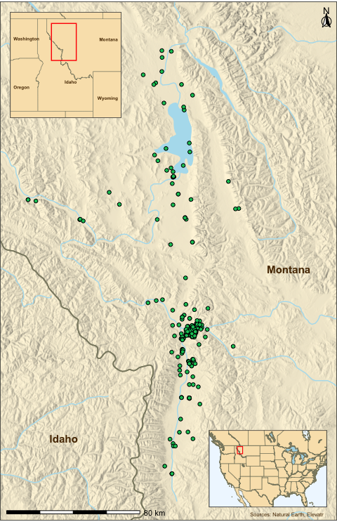
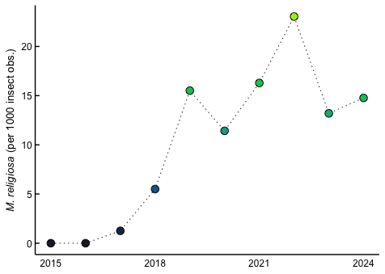

*Mantis religiosa* Observations in Western Montana
================
Beau Larkin
Last updated: 20 October, 2025

- [Description](#description)
- [Packages and Libraries](#packages-and-libraries)
- [Observation Data from
  iNaturalist](#observation-data-from-inaturalist)
  - [iNaturalist Search Query and
    Fields](#inaturalist-search-query-and-fields)
  - [Read and prepare data](#read-and-prepare-data)
- [Maps of Observations](#maps-of-observations)
  - [Continental map inset](#continental-map-inset)
  - [Regional map inset](#regional-map-inset)
  - [ROI map (basemap)](#roi-map-basemap)
  - [Composite Map (Fig. 1)](#composite-map-fig-1)
- [Trends in Observations (Fig. 2)](#trends-in-observations-fig-2)

# Description

This script compiles and maps *Mantis religiosa* observations from
citizen scientists using [iNaturalist](https://www.inaturalist.org) in
western Montana. It produces: 1. A multi-panel map (Fig. 1) of mantid
observations 2. A time series plot (Fig. 2) showing population trends
over the last decade.

# Packages and Libraries

``` r
packages_needed = c(
  "tidyverse", "conflicted", "sf", "rnaturalearth", "rnaturalearthdata",
  "rnaturalearthhires", "ggspatial", "maps", "ggpubr", "ggpmisc", "ggrepel",
  "elevatr", "raster", "cowplot", "ggpp", "Cairo", "colorspace", "rprojroot"
)
packages_installed = packages_needed %in% rownames(installed.packages())
if (any(!packages_installed)) {
  install.packages(packages_needed[!packages_installed])
}
for (i in seq_along(packages_needed)) {
  library(packages_needed[i], character.only = TRUE)
}
```

``` r
root_path <- function(...) rprojroot::find_rstudio_root_file(...)
```

``` r
{
  conflict_prefer("filter", "dplyr")
  conflict_prefer("select", "dplyr")
  conflict_prefer("map", "purrr")
  conflict_prefer("annotate", "ggpp")
  conflict_prefer("lag", "dplyr")
}
```

# Observation Data from iNaturalist

Observations retrieved from [iNaturalist’s Observations Filtering
Tool](https://www.inaturalist.org/observations) on 2024-12-10, focused
on research-grade insect records in a defined region of western Montana.

## iNaturalist Search Query and Fields

- **Pasteable single-line query**
  - quality_grade=research&identifications=any&iconic_taxa%5B%5D=Insecta&swlat=45.83944391979861&swlng=-115.53965091705322&nelat=48.64328798525897&nelng=-112.85902976989746&verifiable=true&spam=false
- **Individual parameters**
  - quality_grade=research
  - identifications=any
  - captive=false
  - swlat=45.83944391979861
  - swlng=-115.53965091705322
  - nelat=48.64328798525897
  - nelng=-112.85902976989746
  - iconic_taxa=Insecta
  - verifiable=true
  - spam=false
- **Fields requested**
  - id
  - observed_on
  - place_guess
  - latitude
  - longitude
  - species_guess
  - scientific_name

## Read and prepare data

``` r
insects <- read_delim(root_path("data", "observations-510925.csv"),
                      show_col_types = FALSE) %>%
  mutate(year = lubridate::year(observed_on))
mantis_obs <- insects %>%
  filter(scientific_name == "Mantis religiosa")
```

# Maps of Observations

This section builds the base layers for the three-panel map
(continental, regional, local).

### Load and crop North America layers

``` r
sf_use_s2(TRUE)
```

    ## Spherical geometry (s2) switched on

``` r
na_continent <- ne_countries(scale = 50, continent = "North America", returnclass = "sf")
us_states <- ne_states(country = c("United States of America", "Canada"), returnclass = "sf")
lakes <- ne_download(scale = 10, type = "lakes", category = "physical", returnclass = "sf")
```

    ## Reading layer `ne_10m_lakes' from data source `/private/var/folders/f2/v4gkwmsn0nbd3fmypfh2wl740000gp/T/RtmpgngHPc/ne_10m_lakes.shp' using driver `ESRI Shapefile'
    ## Simple feature collection with 1355 features and 41 fields
    ## Geometry type: MULTIPOLYGON
    ## Dimension:     XY
    ## Bounding box:  xmin: -165.9656 ymin: -50.66967 xmax: 177.1544 ymax: 81.95521
    ## Geodetic CRS:  WGS 84

``` r
na_bbox <- st_bbox(c(xmin = -130, ymin = 20, xmax = -70, ymax = 55), crs = st_crs(4326))
```

### Plot styles for map components

``` r
cstyle <- list(
  land_col = "#F9E3B9",
  border_col = "lemonchiffon4",
  box_col = "red",
  continent_border_width = 0.2
)
```

## Continental map inset

``` r
continent_map <- ggplot() +
  geom_sf(data = st_crop(na_continent, na_bbox),
          fill = cstyle$land_col,
          color = cstyle$border_col,
          linewidth = cstyle$continent_border_width) +
  geom_sf(data = st_crop(us_states, na_bbox),
          fill = "transparent",
          color = cstyle$border_col,
          linewidth = cstyle$continent_border_width) +
  geom_sf(data = st_crop(st_make_valid(lakes) %>% filter(scalerank < 3), na_bbox),
          fill = "lightblue", color = cstyle$border_col,
          linewidth = cstyle$continent_border_width) +
  geom_rect(aes(xmin = -115.54, ymin = 45.84, xmax = -112.86, ymax = 48.64),
            fill = NA, color = cstyle$box_col, linewidth = 0.4) +
  coord_sf(xlim = c(na_bbox$xmin, na_bbox$xmax), ylim = c(25, na_bbox$ymax), expand = FALSE) +
  theme_void() +
  theme(panel.background = element_rect(fill = "aliceblue"),
        panel.border = element_rect(color = "gray30", fill = NA, linewidth = 0.5))
```

## Regional map inset

``` r
sf_use_s2(FALSE)
```

    ## Spherical geometry (s2) switched off

``` r
regional_box <- st_bbox(c(xmin = -120, ymin = 41.5, xmax = -108, ymax = 49.5), crs = 4326)
rstyle <- list(
  state_lab_size = 1.7,
  state_lab_col = "#563101"
)
```

``` r
regional_map <- ggplot() +
  geom_sf(data = st_crop(us_states, regional_box),
          fill = cstyle$land_col,
          color = cstyle$border_col,
          linewidth = cstyle$continent_border_width) +
  geom_text_repel(
    data = us_states %>% filter(name %in% c("Montana", "Idaho", "Washington", "Oregon", "Wyoming")),
    aes(x = longitude, y = latitude, label = name),
    size = rstyle$state_lab_size,
    color = rstyle$state_lab_col,
    fontface = "bold", segment.color = NA) +
  geom_rect(aes(xmin = -115.54, ymin = 45.84, xmax = -112.86, ymax = 48.64),
            fill = NA, color = cstyle$box_col, linewidth = 0.5) +
  coord_sf(xlim = c(regional_box$xmin, regional_box$xmax),
           ylim = c(regional_box$ymin, regional_box$ymax), expand = FALSE) +
  theme_void() +
  theme(panel.background = element_rect(fill = "aliceblue"),
        panel.border = element_rect(color = "gray30", fill = NA, linewidth = 0.5))
```

### Data for local map of western Montana

``` r
area_box <- st_bbox(c(xmin = -115.54, ymin = 45.84, xmax = -112.86, ymax = 48.64), crs = 4326)
lakes_na <- ne_download(scale = 10, type = "lakes_north_america", category = "physical", returnclass = "sf")
```

    ## Reading layer `ne_10m_lakes_north_america' from data source 
    ##   `/private/var/folders/f2/v4gkwmsn0nbd3fmypfh2wl740000gp/T/RtmpgngHPc/ne_10m_lakes_north_america.shp' using driver `ESRI Shapefile'
    ## Simple feature collection with 1162 features and 36 fields
    ## Geometry type: MULTIPOLYGON
    ## Dimension:     XY
    ## Bounding box:  xmin: -164.2824 ymin: 8.989966 xmax: -54.38915 ymax: 81.00298
    ## Geodetic CRS:  WGS 84

``` r
rivers <- ne_download(scale = 10, type = "rivers_lake_centerlines", category = "physical", returnclass = "sf")
```

    ## Reading layer `ne_10m_rivers_lake_centerlines' from data source 
    ##   `/private/var/folders/f2/v4gkwmsn0nbd3fmypfh2wl740000gp/T/RtmpgngHPc/ne_10m_rivers_lake_centerlines.shp' using driver `ESRI Shapefile'
    ## Simple feature collection with 1473 features and 38 fields
    ## Geometry type: MULTILINESTRING
    ## Dimension:     XY
    ## Bounding box:  xmin: -164.9035 ymin: -52.15775 xmax: 177.5204 ymax: 75.79348
    ## Geodetic CRS:  WGS 84

``` r
rivers_na <- ne_download(scale = 10, type = "rivers_north_america", category = "physical", returnclass = "sf")
```

    ## Reading layer `ne_10m_rivers_north_america' from data source 
    ##   `/private/var/folders/f2/v4gkwmsn0nbd3fmypfh2wl740000gp/T/RtmpgngHPc/ne_10m_rivers_north_america.shp' using driver `ESRI Shapefile'
    ## Simple feature collection with 4897 features and 40 fields (with 19 geometries empty)
    ## Geometry type: MULTILINESTRING
    ## Dimension:     XY
    ## Bounding box:  xmin: -166.3765 ymin: 7.897528 xmax: -53.9444 ymax: 82.63036
    ## Geodetic CRS:  WGS 84

### DEM and hillshade background

``` r
area_sp <- as(raster::extent(area_box["xmin"], area_box["xmax"], area_box["ymin"], area_box["ymax"]),
              "SpatialPolygons")
crs(area_sp) <- st_crs(4326)$proj4string
area_dem <- get_elev_raster(st_as_sf(area_sp), z = 8)
```

    ##  Accessing raster elevation [-------------------------]   0%                                                             Accessing raster elevation [-------------------------]   0% Accessing raster elevation [=>-----------------------]   8%                                                             Accessing raster elevation [=>-----------------------]   8% Accessing raster elevation [===>---------------------]  17%                                                             Accessing raster elevation [===>---------------------]  17% Accessing raster elevation [=====>-------------------]  25%                                                             Accessing raster elevation [=====>-------------------]  25% Accessing raster elevation [=======>-----------------]  33%                                                             Accessing raster elevation [=======>-----------------]  33% Accessing raster elevation [=========>---------------]  42%                                                             Accessing raster elevation [=========>---------------]  42% Accessing raster elevation [===========>-------------]  50%                                                             Accessing raster elevation [===========>-------------]  50% Accessing raster elevation [==============>----------]  58%                                                             Accessing raster elevation [==============>----------]  58% Accessing raster elevation [================>--------]  67%                                                             Accessing raster elevation [================>--------]  67% Accessing raster elevation [==================>------]  75%                                                             Accessing raster elevation [==================>------]  75% Accessing raster elevation [====================>----]  83%                                                             Accessing raster elevation [====================>----]  83% Accessing raster elevation [======================>--]  92%                                                             Accessing raster elevation [======================>--]  92% Accessing raster elevation [=========================] 100%
    ## Mosaicing & Projecting
    ## Note: Elevation units are in meters.

``` r
area_terrain <- list(
  slope = terrain(area_dem, opt = "slope"),
  aspect = terrain(area_dem, opt = "aspect")
)
area_hill <- hillShade(area_terrain$slope, area_terrain$aspect, angle = 70, direction = 270, normalize = TRUE) %>%
  rasterToPoints() %>%
  as.data.frame()
colnames(area_hill) <- c("lon", "lat", "hillshade")
```

## ROI map (basemap)

``` r
astyle <- list(water_col = "lightblue2", state_lab_size = 4, state_border_width = 0.6)
```

``` r
area_map <- ggplot() +
  geom_raster(data = area_hill, aes(x = lon, y = lat, fill = hillshade), interpolate = TRUE) +
  geom_sf(data = st_crop(us_states, area_box), color = cstyle$border_col, fill = "transparent",
          linewidth = astyle$state_border_width) +
  geom_text_repel(
    data = st_crop(us_states, area_box),
    aes(x = longitude, y = latitude, label = name),
    size = astyle$state_lab_size,
    color = rstyle$state_lab_col,
    nudge_x = c(-0.9, -3.2), nudge_y = c(2.5, 0.2),
    segment.color = NA, fontface = "bold") +
  geom_sf(data = st_crop(lakes, area_box), fill = astyle$water_col, color = "transparent") +
  geom_sf(data = st_crop(lakes_na, area_box), fill = astyle$water_col, color = "transparent") +
  geom_sf(data = st_crop(rivers, area_box), color = astyle$water_col) +
  geom_sf(data = st_crop(rivers_na, area_box), color = astyle$water_col) +
  geom_point(data = mantis_obs, aes(x = longitude, y = latitude), fill = "#00C465", shape = 21, size = 1.6) +
  annotation_scale(location = "bl", width_hint = 0.4, height = unit(0.12, "cm")) +
  annotation_north_arrow(location = "tr", which_north = "true",
                         height = unit(0.75, "cm"), width = unit(0.6, "cm"),
                         pad_x = unit(0.1, "cm"), pad_y = unit(0.3, "cm"),
                         style = north_arrow_fancy_orienteering()) +
  geom_text_npc(data = data.frame(x = 0.96, y = 0.008, src_lab = "Sources: Natural Earth, Elevatr"),
                aes(npcx = x, npcy = y, label = src_lab),
                color = rstyle$state_lab_col, size = 2) +
  coord_sf(xlim = c(area_box$xmin, area_box$xmax),
           ylim = c(area_box$ymin, area_box$ymax), expand = FALSE) +
  scale_fill_gradient(low = "#2C2C2C", high = "#FFF6DD", guide = "none") +
  theme_void() +
  theme(panel.background = element_rect(fill = "aliceblue"),
        panel.border = element_rect(color = "gray30", fill = NA, linewidth = 0.5))
```

## Composite Map (Fig. 1)

``` r
fig1 <- cowplot::ggdraw() +
  cowplot::draw_plot(area_map) +
  cowplot::draw_plot(regional_map, x = 0.03, y = 0.98, width = 0.33, height = 0.209, hjust = 0, vjust = 1) +
  cowplot::draw_plot(continent_map,  x = 0.97, y = 0.025, width = 0.35, height = 0.154, hjust = 1, vjust = 0)
```

``` r
fig1
```



Fig. 1 Map displays the focal area in western Montana under invasion by
*M. religiosa*. Inset maps show the focal area enclosed in a red box.
Green points on the base map show locations of *M. religiosa*
observations made by citizen scientists from 2015-2024 and downloaded
from iNaturalist

# Trends in Observations (Fig. 2)

``` r
pop_trend <- insects %>%
  count(year, name = "n_insects") %>%
  left_join(
    insects %>% filter(scientific_name == "Mantis religiosa") %>%
      count(year, name = "n_mantis"),
    by = join_by(year)) %>%
  filter(year >= 2015) %>%
  mutate(n_mantis = replace_na(n_mantis, 0),
         pct_mantis = n_mantis / n_insects * 100,
         cold_snaps = c(rep(0, 7), 1, 2, 0))
```

Figure style (load theme arguments)

``` r
source(root_path("supplement", "styles.R"))
```

``` r
fig2 <- ggplot(pop_trend, aes(x = year, y = pct_mantis * 10)) +
  geom_line(color = "gray20", linetype = "dotted", linewidth = 0.4) +
  geom_point(aes(fill = pct_mantis * 10), color = "black", shape = 21, size = 3, show.legend = FALSE) +
  scale_fill_continuous_sequential(c1 = 100, c2 = 7, cmax = 150, l1 = 86, l2 = 13, h1 = 109, h2 = 252,
                                   p1 = 0.5, p2 = 0.9, rev = TRUE) +
  scale_x_continuous(name = NULL, breaks = seq(2015, max(pop_trend$year), by = 3)) +
  labs(y = expression(italic("M. religiosa") * " (per 1000 insect obs.)")) +
  theme_bgl_s
```

``` r
fig2
```



Fig. 2 Points represent observations of *Mantis religiosa* per 1000
insect observations per year in the focal area shown on Fig. 1. Data for
mantid and insect observations were downloaded from iNaturalist. The
color gradient corresponds to the observation rate (y-axis value)
