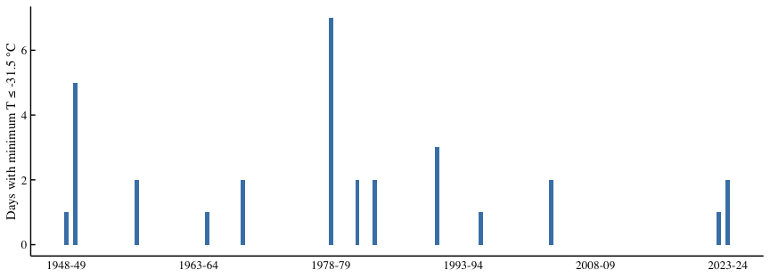

Western Montana: Historical Extreme Cold Snaps
================
Beau Larkin
Last updated: 12 May, 2025

- [Description](#description)
- [Packages and Libraries](#packages-and-libraries)
  - [Graphics Style](#graphics-style)
- [Data Preparation](#data-preparation)
- [Cold Snap Analysis](#cold-snap-analysis)
  - [Visualization of Cold Snaps](#visualization-of-cold-snaps)

# Description

This script summarizes historical weather conditions in western Montana
and visualizes the frequency of extreme winter cold events that may
influence *Mantis religiosa* survival. Weather data were downloaded from
[NOAA](https://www.ncdc.noaa.gov/cdo-web/search) as a custom GHCN-daily
CSV file and include daily observations from Missoula and Kalispell
airports spanning 1948–2024. Temperatures were averaged across both
sites, and winter years were defined to span July–June to align
cold-season conditions with subsequent growing seasons. Cold snaps were
identified as days when minimum temperatures fell below –31.5 °C, a
threshold associated with significant mantid egg mortality in laboratory
studies.

# Packages and Libraries

``` r
packages_needed = c("tidyverse", "lubridate", "rprojroot")
packages_installed = packages_needed %in% rownames(installed.packages())

if (any(!packages_installed)) {
  install.packages(packages_needed[!packages_installed])
}
```

``` r
for (i in seq_along(packages_needed)) {
  library(packages_needed[i], character.only = TRUE)
}
```

``` r
root_path <- function(...) rprojroot::find_rstudio_root_file(...)
```

## Graphics Style

``` r
source(root_path("supplement", "styles.R"))
```

# Data Preparation

Weather data were downloaded in successive batches as the project
evolved

``` r
wx_files <- list.files(
  path = root_path("data", "weather_data"),
  pattern = "wmt_weather",
  full.names = TRUE
)
wx <- wx_files %>%
  map(read_delim, show_col_types = FALSE) %>%
  bind_rows() %>%
  filter(DATE >= as.Date("1948-07-01")) %>% 
  group_by(DATE) %>%
  summarize(across(where(is.numeric), ~ mean(.x, na.rm = TRUE)), .groups = "drop") %>%
  mutate(
    doy = yday(DATE),
    year = year(DATE),
    month = month(DATE),
    winter_year_begin = ifelse(month >= 7, year, year - 1),
    winter_year_end = winter_year_begin + 1,
    winter_year = paste(winter_year_begin, str_sub(winter_year_end, 3, 4), sep = "-")
  ) %>%
  filter(DATE <= as.Date("2024-06-30"))
```

# Cold Snap Analysis

All *M. religiosa* embryos survived to –23.8 °C (–11 °F) in laboratory
studies [(Salt and James
1947)](https://scholar.google.com/scholar_lookup?title=Low+temperature+as+a+factor+in+the+mortality+of+eggs+of+Mantis+religiosa+L.&author=R.+W.+Salt&author=H.+G.+James&volume=79&publication_year=1947&pages=33-36).
At –31.5 °C (–24 °F), approximately 30% of mantid eggs perished. We
define the winter severity node as the number of days where TMIN fell
below this threshold.

``` r
all_winters <- data.frame(
  winter_year = unique(wx$winter_year),
  winter_year_end = unique(wx$winter_year_end)
)
snaps <-
  all_winters %>%
  left_join(
    wx %>%
      filter(TMIN <= -24) %>%
      group_by(winter_year) %>%
      summarize(cold_snaps = n(), .groups = "drop"),
    by = join_by(winter_year)
  ) %>%
  mutate(cold_snaps = ifelse(is.na(cold_snaps), 0, cold_snaps))
```

## Visualization of Cold Snaps

``` r
figS1 <- 
  snaps %>%
  filter(cold_snaps > 0) %>%
  ggplot(aes(x = winter_year_end, y = cold_snaps)) +
  geom_col(width = 0.5, fill = "steelblue") +
  scale_x_continuous(
    breaks = seq(1949, 2024, 15),
    labels = snaps$winter_year[match(seq(1949, 2024, 15), snaps$winter_year_end)]
  ) +
  labs(x = NULL, y = "Days with minimum T \u2264 -31.5 \u00B0C") +
  theme_bgl_s +
  theme_supplement
```

``` r
figS1
```



**Fig. S1** Number of winter cold snaps per year in western Montana from
1948–49 to 2023–24. Cold snaps are defined as days when the daily
minimum temperature (TMIN) fell at or below –31.5 °C, a threshold
associated with significant *M. religiosa* egg mortality. Weather data
are averaged from Missoula and Kalispell airports.
